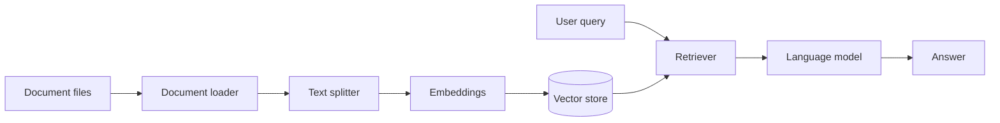
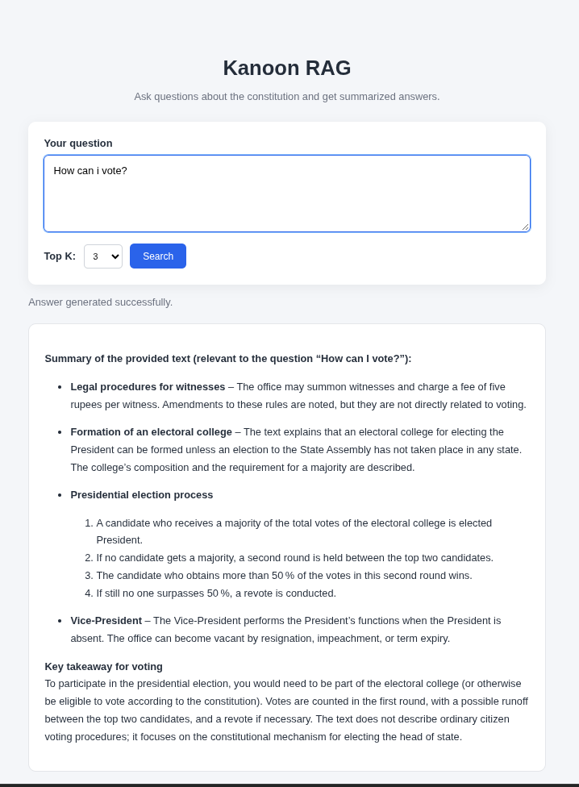

# Kanoon Ragendra

## Architecture

```mermaid
flowchart LR
	A[Document files] --> B[Document loader]
	B --> C[Text splitter]
	C --> D[Embeddings]
	D --> E[(Vector store)]
	Q[User query] --> F[Retriever]
	E --> F
	F --> G[Language model]
	G --> H[Answer]
```
## API KEY

Set `GROQ_API_KEY` in the env

## Output

